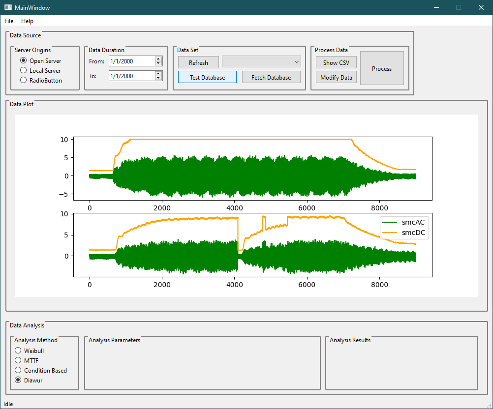

# Data GUI

---

## Data Example

Data Repository: [Prognostics Center of Excellence Data Set Repository - NASA](https://www.nasa.gov/intelligent-systems-division/discovery-and-systems-health/pcoe/pcoe-data-set-repository/)

Milling Data Example: [Download](https://data.nasa.gov/download/vjv9-9f3x/application%2Fzip)

Path for data example: **DataGUI/dataset/mill/mill.mat**

---

## Technical Requirements

- Software AVEVA PIVision already exist and functional
- Develop algorithm to analyze and model the data
- Integrate the algorithm to PIVision
- Testing on-site using recent data

---

## Setup

### Generic Python

Interpreter Installation: [Guide](https://github.com/mekatronik-achmadi/md_tutorial/blob/master/pelatihan/install_python.md)

Module Installations:

```batch
pip install PyQt6 matplotlib numpy pandas scipy
```

Run Test

```batch
python main.py
```



---

## Deployment

### Windows

Using [pynsist](https://github.com/takluyver/pynsist), based on [NSIS](https://nsis.sourceforge.io/Download)
